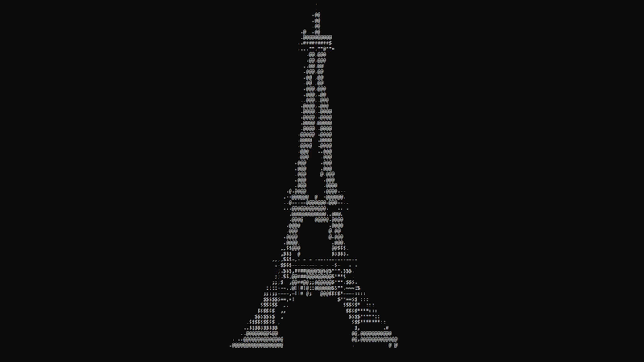
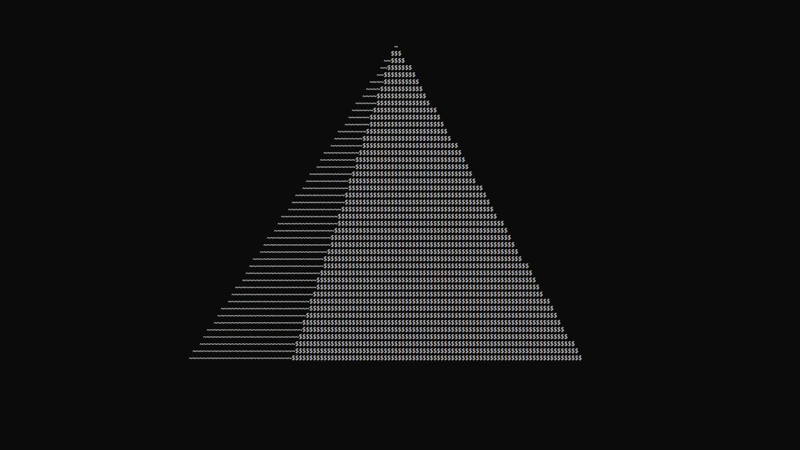
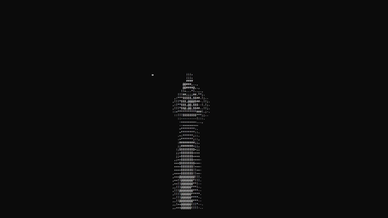
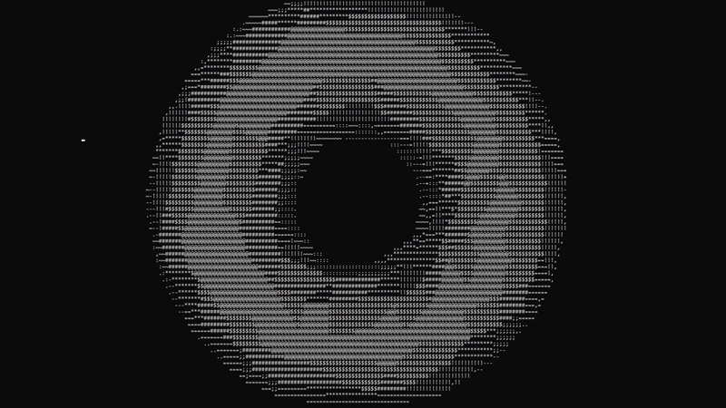
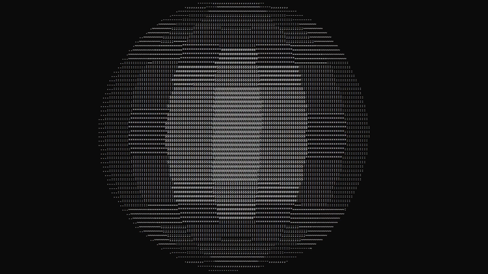

# 3D-ASCII-Rasterizer
A 3D ASCII rasterizer renderer that loads `.obj` models and displays them in your terminal, written entirely in Lua, with no graphics library or GPU involved.
## Features
- **Z-Buffering** per-pixel depth testing for correct overlap rendering
- **Back-Face Culling** skips hidden faces using dot product on surface normals
- **Dynamic Shading** lighting based on face angle to the camera
- **Delta Time** frame-rate independent animation
- **.obj Model Loading** parses standard Wavefront .obj files

